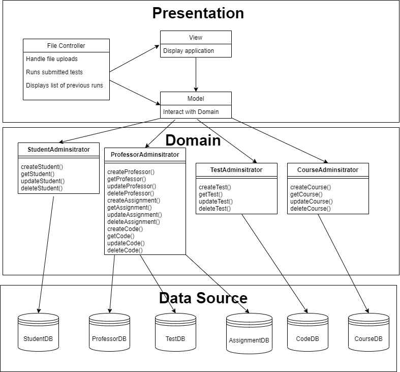
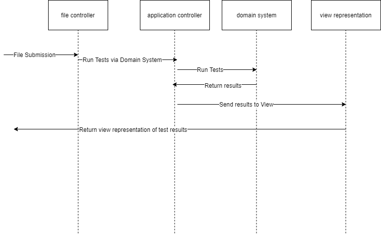

# Compile.io MVC Lab - David Gruninger

Date: 9/11/2020 - 9/15/2020

## Part A - Design

### 1. Review your Active Record architecture you made for compile.io

I have linked my Active Record architecture from earlier in the week below.

### 2. Sketch two possible controllers for the provided use case, showing how they interact with your Active Record:

Below is my sketch for Input controller. I used another tool to better represent the model view controller relationship within the presentation layer.

Below is my sketch for Input controller + Application Controller

### 3. Compare the sequence diagrams for the two different controller patterns for the use case’s Basic Flow.

First of all, it is pretty clear that both designs are essentially doing the same thing; relaying information about the file submission from the MVC down to the domain layer.
However, the input + application controller is also using a separate application controller. Since both architectures are accomplishing the same thing, I think
it makes more sense to use the input controller because we need **one fewer class** within our system. We can communicate with the domain perfectly fine
without an application controller with how the input controller pattern has been set up.

### 4. Pick one of these as "best" and say why.

For the reason described above, I think it makes sense to use the **input controller** as the architectural pattern for this application. In comparing two designs
that accomplish the same task, it is wise to choose the design with **less code**. This means the system will be less complex and require less overall work in the
implementation of the system.

## Part B - Code