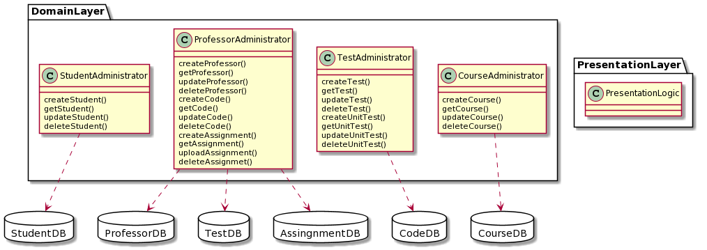

# Compile.io MVC Lab - David Gruninger

Date: 9/11/2020 - 9/15/2020

## Part A - Design

### 1. Review your Active Record architecture you made for compile.io

I have linked my Active Record architecture from earlier in the week below.

### 2. Sketch two possible controllers for the provided use case, showing how they interact with your Active Record:

Below is my sketch for Input controller

Below is my sketch for Input controller + Application Controller

## Part B - Code