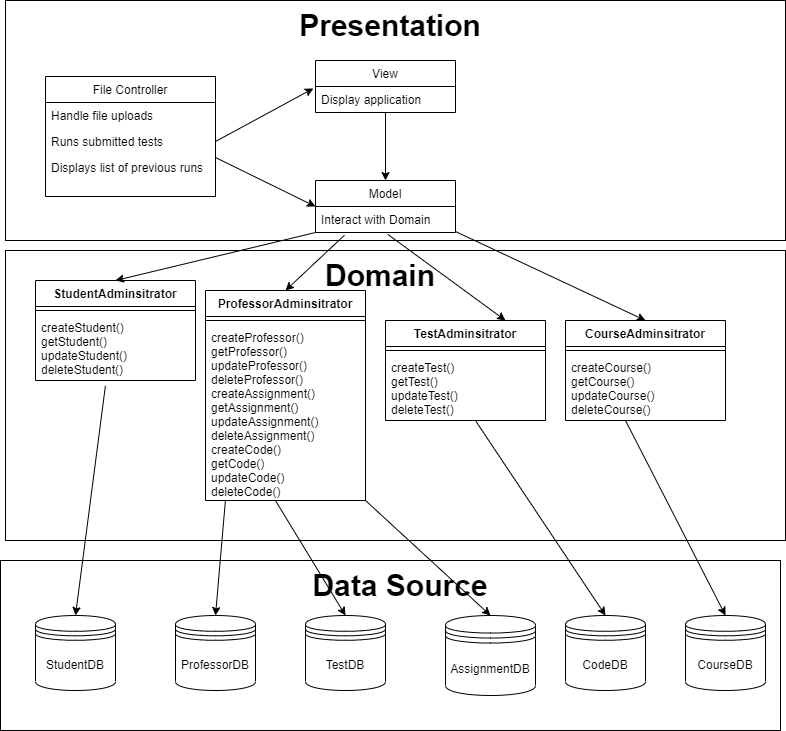
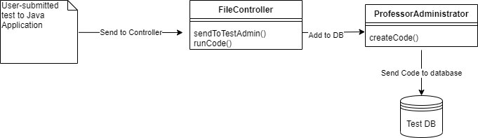

# Compile.io MVC Lab Design Document - David Gruninger

Date: 9/11/2020 - 9/15/2020

## 1. Review your Active Record architecture you made for compile.io

I have linked my Active Record architecture from earlier in the week below.

## 2. Sketch two possible controllers for the provided use case, showing how they interact with your Active Record:

Below is my sketch for Input controller. I used another tool to better represent the model view controller relationship within the presentation layer.

Below is my sketch for Input controller + Application Controller

I also added a sequence diagram as well for the application controller.

## 3. Compare the sequence diagrams for the two different controller patterns for the use case’s Basic Flow.

First of all, it is pretty clear that both designs are essentially doing the same thing; relaying information about the file submission from the MVC down to the domain layer.
However, the input + application controller is also using a separate application controller. Since both architectures are accomplishing the same thing, I think
it makes more sense to use the input controller because we need **one fewer class** within our system. We can communicate with the domain perfectly fine
without an application controller with how the input controller pattern has been set up.

## 4. Pick one of these as "best" and say why.

For the reason described above, I think it makes sense to use the **input controller** as the architectural pattern for this application. In comparing two designs
that accomplish the same task, it is wise to choose the design with **less code**. This means the system will be less complex and require less overall work in the
implementation of the system.

## 5. Add a View design of your choice

I will be using the Template view pattern. My sample design is below:

## 6. Explain why you believe this View works well with your Controller.

I choose the Template pattern for a couple reasons. One being that I have already had experience using the Template pattern in both 374 and Android development,
and so therefore I am more comfortable using it. The other reason that I picked the Template pattern had to do with simplicity. It is best if we keep the MVC
relatively simple, and the Template pattern allows for **effective communication between the view and the controller**, which is essential for our architecture. In order
for the file controller to be able to successfully communicate with the view of the test submission, there must be clear and easy transfer of data between the
two modules. This is why the Template pattern works; **it is built for the easy communication of data between these two modules**. This will lead to a strong
connection between the domain and presentation layer, which overall gives us a better architecture.

### Try to guess how much work it would have been to do this using the other Controller choice.  Did you guess right, or not?

It would have been more work to add in the application controller simply because it would not have been necessary. I believe my guess for using just the input
controller was the correct guess.

### Which Controller choice would be easier to add more use cases to?

I think the input controller would be easier to add more use cases to. This is simply due to the fact that the input controller is able to handle a lot of cases
as is, and putting in the application controller really isn't necessary to adding more use cases. The input controller already communicates well with the Model and
View, so it can handle more use cases as is.

### Did the Controller you chose allow you to do everything win the use case?

Yes, I was able to address or simulate everything that was needed for the provided use case.